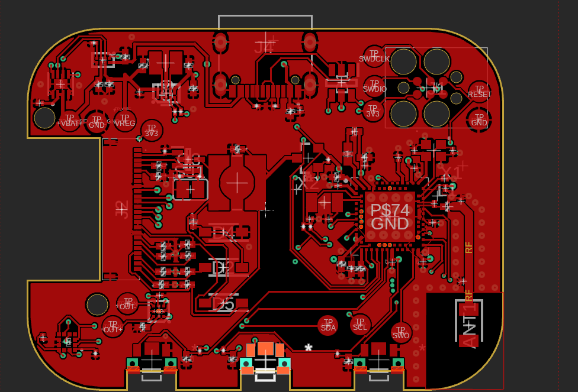
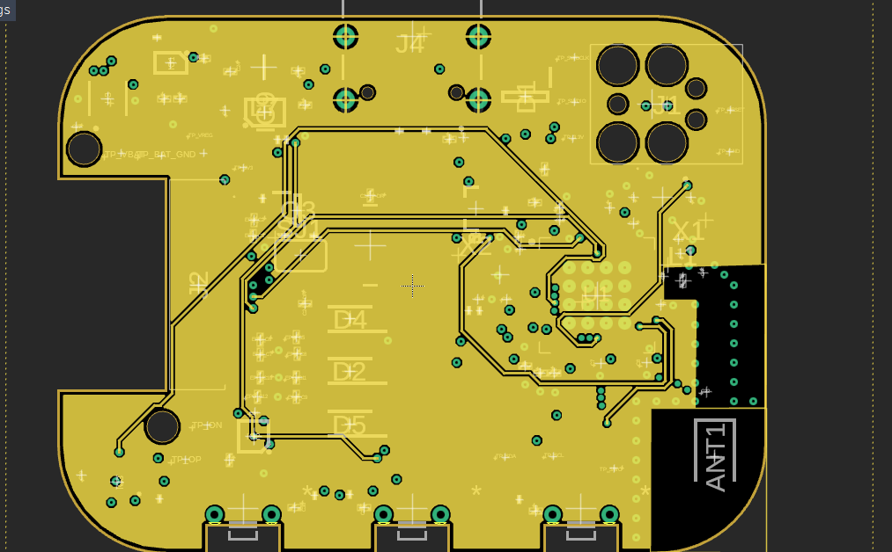
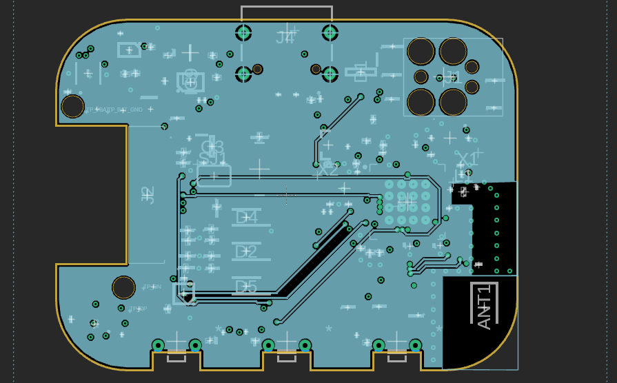
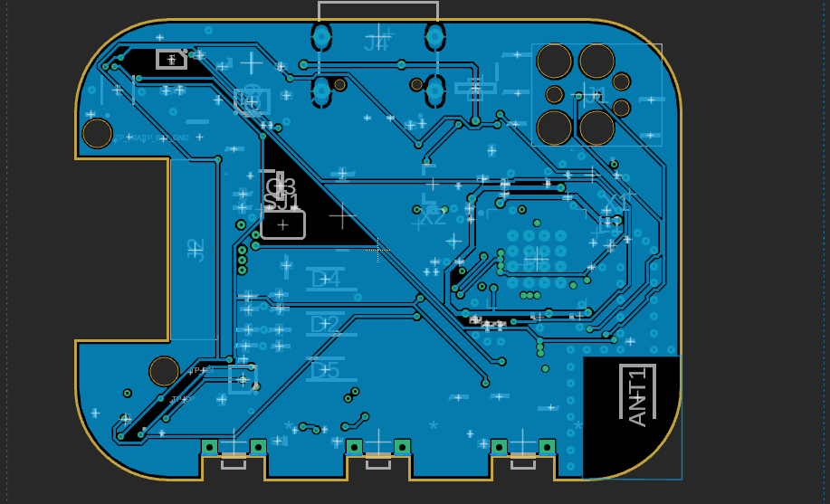
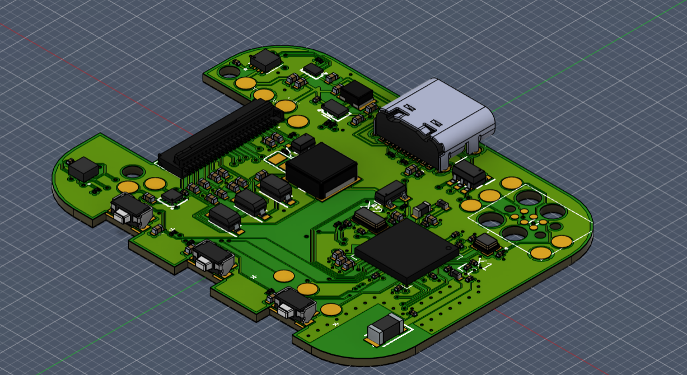

# TSC-homework - Stefan Calmac 334CC
# InkTime Watch


---

## Block Diagram

```
           [ USB Type-C ]                              [ LiPo Battery (250mAh) ]
                 | 5V VBUS                                      |
                 v                                              |
          +---------------+                                     |
          |               | BAT                                 |
          |    BQ25180    |<------------------------------------+
          | (Charger IC)  |                                     |
          +---------------+                                     v
                 | VSYS                                 +---------------+
                 v                                      |   MAX17048    |
          +---------------+                             | (Fuel Gauge)  |
          |    RT6160     |                             +---------------+
          | (Buck-Boost)  |                                     ^
          +---------------+                                     |
                 | 3.3V System Rail (VDD_3V3)                   |
                 |                                              |
 +---------------+----------------------------------------------+-----+
 |               |                                              |     |
 |               v                                              |     |
 |        +-------------+         I2C Bus                       |     |
 |        |             |<======================================+     |
 |        |             |                                             |
 |        |             |=== I2C ===> [ BMA421 Accelerometer ]        |
 |        |  nRF52840   |                                             |
 |        |    MCU      |=== I2C ===> [ DRV2605L Driver ]-->[ Motor ] |
 |        |             |                                             |
 |        |             |=== SPI ===> [ 1.54" E-paper Display ]       |
 |        |             |                       ^                     |
 |        |             |-- GPIO (Gate)         | VEPD (Switched Pwr) |
 |        +-------------+      |                |                     |
 |          ^  ^  ^  |         v                |                     |
 |          |  |  |  | +---------------+        |                     |
 +---------(|--|--|)-+-|  PFET Switch  |--------+                     |
            |  |  |  | +---------------+                              |
 [Up]-------+  |  |  |                                                |
           [Down] |  +--- [ 2.4GHz Antenna ] - - - BLE - - - [ Companion ]
                  |                                          [   Phone   ]
              [Enter/Esc]
```

---

## Bill of Materials (BOM)

Below is the list of primary active and critical passive components used in this
design. Links are provided to JLCPCB parts (LCSC) and standard datasheets.

| Component / Module | Description | Package / Footprint | Part | Datasheet Link |
:--- | :--- | :--- | :--- | :--- |
| **nRF52840** | Multi-protocol BLE 5.0 Cortex-M4F MCU | AQFN-73 | [C190794](https://jlcpcb.com/partdetail/NordicSemicon-NRF52840_QIAAR/C190794) | [Nordic nRF52840](https://www.nordicsemi.com/Products/nRF52840) |
| **BQ25180YBGR** | I2C Controlled 1A Linear LiPo Charger | DSBGA-8 | [BQ25180YBGR](https://www.ti.com/product/BQ25180/part-details/BQ25180YBGR) | [TI BQ25180](https://www.ti.com/product/BQ25180) |
| **MAX17048G+T10** | Micropower 1-Cell Fuel Gauge | TDFN-8 | [C2682616](https://www.lcsc.com/product-detail/C2682616.html) | [Maxim MAX17048](https://www.analog.com/en/products/max17048.html) |
| **RT6160AWSC** | High-Efficiency Buck-Boost Converter (3.3V) | WLCSP-15 | [C7065276](https://www.lcsc.com/product-detail/C7065276.html) | [Richtek RT6160A](https://www.richtek.com/assets/product_file/RT6160A/DS6160A-02.pdf) |
| **BMA421** | Ultra-Low Power IMU / Step Counter | LGA-12 | [C5242966](https://jlcpcb.com/partdetail/BoschSensortec-BMA421/C5242966) | [Bosch BMA421](https://www.bosch-sensortec.com/products/motion-sensors/imus/bma421/) |
| **DRV2605YZFR** | Haptic Driver for LRA/ERM | DSBGA-9 | [C527464](https://jlcpcb.com/partdetail/C527464) | [TI DRV2605](https://www.ti.com/product/DRV2605) |
| **2450AT18B100E** | 2.4GHz Chip Antenna | 1206 | [C2917717](https://jlcpcb.com/partdetail/JohansonDielectrics-2450AT18B100E/C2917717) | [Johanson 2450AT18B100E](https://www.johansontechnology.com/datasheets/antennas/2450AT18B100.pdf) |
| **USBLC6-2SC6Y** | Very low capacitance ESD protection | SOT-23-6 | [C2969755](https://jlcpcb.com/partdetail/STMicroelectronics-USBLC62SC6Y/C2969755) | [ST USBLC6-2](https://www.st.com/resource/en/datasheet/usblc6-2.pdf) |
| **KH-TYPE-C-16P** | USB Type-C 16-Pin Receptacle | SMD | [C168704](https://jlcpcb.com/partdetail/180087-918418K2022Y40000/C168704) | [Generic USB-C](https://datasheet.lcsc.com/lcsc/1811151641_Korean-Hroparts-Elec-TYPE-C-31-M-12_C165948.pdf) |
| **503480-2400** | 24-Pin FPC Connector (0.5mm pitch) for EPD | SMD |  | [Molex 503480](https://www.molex.com/molex/products/part-detail/ffc_fpc_connectors/5034802400) |
| **DMG2305UX** | P-Channel MOSFET (EPD Power Control) | SOT-23 | [C2940629](https://jlcpcb.com/partdetail/TECHPUBLIC-DMG2305UX/C2940629) | [Diodes DMG2305](https://www.diodes.com/assets/Datasheets/DMG2305UX.pdf) |
| **MBR0530** | Schottky Diode (E-Paper Pump Circuit) | SOD-123 | [C77336](https://jlcpcb.com/partdetail/78464-MBR0530/C77336) | [Onsemi MBR0530](https://www.onsemi.com/pdf/datasheet/mbr0530t1-d.pdf) |
| **TC2030-IDC** | 6-Pin Tag-Connect SWD Interface | PCB Footprint | [Tag-Connect](https://www.tag-connect.com/product/tc2030-idc-nl) | [Tag-Connect TC2030](https://www.tag-connect.com/product/tc2030-idc-6-pin-tag-connect-plug-of-nails-spring-pin-cable-with-ribbon-connector) |

### Passive Components

| Component | Value | Package | Qty | Function |
|-----------|-------|---------|-----|----------|
| Capacitors (decoupling) | 100nF | 0201 | 5 | MCU + peripheral decoupling |
| Capacitors (crystal load) | 12pF | 0201 | 4 | 32MHz + 32.768kHz crystal loads |
| Capacitors (bulk) | 4.7uF | 0402 | 4 | MCU power rail bulk decoupling |
| Capacitors (USB) | 4.7uF | 0402 | 1 | DECUSB capacitor |
| Capacitors (power) | 22uF | 0402 | 2 | RT6160 input capacitors |
| Capacitors (charger) | 1uF | 0402 | 3 | BQ25180 CIN/CSYS/CBAT |
| Capacitors (EPD) | 1uF/50V | 0402 | 9 | E-paper driver capacitors |
| Inductor (DC/DC) | 10uH | 0402 | 1 | nRF52840 REG1 DC/DC inductor |
| Inductor (buck-boost) | 0.47uH | 2012 | 1 | RT6160 power stage inductor |
| Resistors (I2C pull-up) | 10k | 0201 | 2 | I2C SDA/SCL pull-ups |
| Resistors (USB CC) | 5.1k | 0201 | 2 | USB Type-C CC1/CC2 pull-downs |
| Crystals | 32 MHz | 2016 | 1 | HFXO for MCU + radio |
| Crystals | 32.768 kHz | 3215 | 1 | LFXO for RTC timekeeping |

---

## Hardware Description

### MCU - nRF52840

The nRF52840 is the central processing unit of InkTime. It integrates:

- **ARM Cortex-M4F** at 64 MHz with FPU
- **BLE 5.0** (used for time sync, notifications)
- **USB 2.0 Full Speed** (charging detection and firmware updates)
- **1 MB Flash / 256 KB RAM**

All peripherals are connected directly to the nRF52840 via SPI (e-paper display) and I2C (IMU, fuel gauge, haptic driver, PMIC).

### Power Path

```
USB-C --> BQ25180 (charger) --> LiPo battery (AKY0106, 400 mAh)
                            --> 3.3V rail (VREG, for MCU and all peripherals)
Battery --> RT6160AWSC (boost) --> EPD high-voltage supply (VCOM, gate voltages)
```

- **BQ25180YBGR** manages LiPo charging at up to 1A, monitors VBUS, and raises `PMIC_INT` for fault/status events. Communicates with the MCU over I2C.
- **RT6160AWSC** is a boost converter that generates the higher voltages needed by the e-paper display driver (PREVGH, PREVGL, etc.).
- **MAX17048G+T10** is a ModelGauge fuel gauge that estimates battery state-of-charge (SOC) with 1% accuracy over I2C, using a single-cell LiPo model.

### E-Paper Display - WSH-12561

The e-paper display connects to the MCU over **SPI** plus 3 control GPIOs:

| Signal   | Direction | Description                 |
| -------- | --------- | --------------------------- |
| SCK      | MCU → EPD | SPI clock                   |
| MOSI     | MCU → EPD | SPI data                    |
| EPD_CS   | MCU → EPD | Chip select (active low)    |
| EPD_DC   | MCU → EPD | Data / Command select       |
| EPD_RST  | MCU → EPD | Hardware reset (active low) |
| EPD_BUSY | EPD → MCU | Busy flag (MCU must wait)   |

The EPD drive circuit (biased by RT6160AWSC) generates the voltages PREVGH, PREVGL, PREVGL, GDR necessary to drive the e-paper panel.

### IMU

6-axis inertial measurement unit connected via **I2C** at 400 kHz. Provides:

- 3-axis accelerometer (step counting, gesture detection, orientation)
- 3-axis gyroscope (motion tracking)
- Two interrupt lines (`IMU_INT1`, `IMU_INT2`) for wake-on-motion and data-ready events

### Haptic Feedback - DRV2605 + FIT0774

The DRV2605YZFR haptic driver controls the FIT0774 ERM motor. It connects to the MCU over **I2C** and has a digital enable signal `HAPTIC_EN`. It supports library-based waveform playback (124 built-in effects).

### USB - KH-TYPE-C-16P + USBLC6-2SC6Y

USB-C connector with USBLC6-2SC6Y ESD protection on D+ and D− lines. The MCU detects VBUS presence via a GPIO for charging control handoff. USB D+ / D− connect directly to the nRF52840's USB transceiver.

### Antenna - 2450AT18B100E

2.4 GHz chip antenna placed at the PCB edge, away from metal and ground planes. The PCB is **cutout under the antenna** - no copper pours or signal traces are routed under the antenna keepout area. Impedance matching network (L + C pi filter) is present between the nRF52840 RF pin and the antenna.

### SWD Debug - TC2030-IDC

Tag-Connect TC2030-IDC footprint for in-circuit programming and debugging (no connector needed, uses spring-loaded probe). Test pads TP_SWDIO, TP_SWDCLK, TP_RESET, TP_3.3V, TP_GND are exposed on the PCB silkscreen.

---

## nRF52840 Pinout Specification
The major hardware peripherals are mapped to the MCU as follows:

*   **Shared I2C Bus (with 10k pull-ups to 3.3V):**
    *   `P0.06` - SDA (Data for BMA421, MAX17048, BQ25180, RT6160, DRV2605L).
    *   `P0.07` - SCL (Clock).
*   **SPI Bus (E-paper Display):**
    *   `P0.02` - SCK
    *   `P0.03` - MOSI
    *   `P0.05` - CS (Chip Select)
    *   `P0.15` - DC (Data/Command)
    *   `P0.16` - RST (Reset)
    *   `P0.17` - BUSY (Panel status)
    *   `P1.01` - PFET Gate (Enables/disables the display power rail)
*   **Interrupts & Peripherals:**
    *   `P0.08` - BMA421 INT1 (Primary motion/step wake).
    *   `P1.08` - BMA421 INT2 (Secondary motion events).
    *   `P0.10` - MAX17048 ALRT (Low battery wake).
    *   `P0.11` - BQ25180 /INT (Charger state wake).
    *   `P0.12` - DRV2605L EN (Enable haptics chip).
*   **Physical Buttons (Active-low to GND):**
    *   `P0.13` - Up Button.
    *   `P0.14` - Down Button.
    *   `P1.00` - Enter / Esc Button.
*   **Debug & Clocks:**
    *   `XC1/XC2` & `XL1/XL2` - Connects the 32MHz and 32.768kHz external crystals.
    *   `SWDIO`, `SWDCLK`, `nRESET` - Connected to the Tag-Connect TC2030 debug footprint.

--- 

## PCB Design











